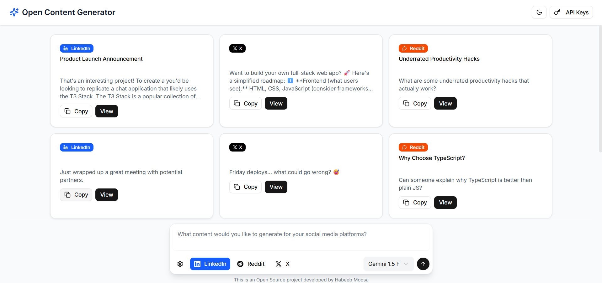

<div align="center">



# Open Content Generator

**Generate AI-powered content for LinkedIn, Reddit, and X (Twitter)**

[🌐 Live Website](https://opencontentgenerator.vercel.app)

</div>

## ✨ Features

- 🎯 **Multi-Platform Content Generation** - Create posts for X (Twitter), LinkedIn, and Reddit
- ⚙️ **Smart Post Configuration** - Customize content style and tone for each platform
- 🤖 **AI Model Support** - Works with OpenAI GPT and Google Gemini models
- 🔐 **Secure API Key Storage** - Encrypted local storage for your API keys
- 🎨 **Modern UI/UX** - Professional interface with dark/light theme support
- 📱 **Responsive Design** - Works seamlessly on desktop and mobile devices

## 🔐 API Key Encryption

This application includes a robust encryption system for storing API keys securely in localStorage:

### Setup

#### 1. Create a `.env` file in the root directory

#### 2. Add your encryption key:
   ```env
   NEXT_PUBLIC_ENCRYPTION_KEY=your-secure-32-character-encryption-key-here
   ```

### How it works

- API keys are encrypted with the Encryption Key on the client-side before being stored in localStorage
- When content generation is requested, the encrypted API key is sent to the server
- The server decrypts the API key using the same Encryption Key before using it with AI models
- The Encryption Key is stored as the `NEXT_PUBLIC_ENCRYPTION_KEY` environment variable

## 🚀 Getting Started

### Prerequisites

- Node.js 18+ 
- npm or yarn
- OpenAI API key and/or Google Gemini API key

### Installation

#### 1. Clone the repository

```bash
git clone https://github.com/habeebmoosa/OpenContentGenerator.git
cd OpenContentGenerator
```

#### 2. Install dependencies

```bash
npm install
```

#### 3. Set up your environment variables

Create a `.env` file in the root directory and add:

```env
NEXT_PUBLIC_ENCRYPTION_KEY=your-secure-32-character-encryption-key-here
```

#### 4. Run the development server

```bash
npm run dev
```

#### 5. Open [http://localhost:3000](http://localhost:3000) in your browser

## 📖 Usage

1. **Configure API Keys** - Click "API Keys" to set up your OpenAI and Google Gemini API keys
2. **Enter Content Prompt** - Describe what content you want to generate
3. **Customize Style** - Configure the post generation style and tone if needed
4. **Select Platforms** - Choose which social media platforms to generate content for
5. **Generate Content** - Click "Generate" to create your AI-powered posts
6. **Copy & Share** - Copy the generated content and share directly to your social media platforms

## 🛠️ Tech Stack

- **Frontend**: Next.js 15, React, TypeScript
- **Styling**: Tailwind CSS, shadcn/ui components
- **AI Integration**: OpenAI API, Google Gemini API
- **Security**: Client-side encryption for API keys
- **Deployment**: Vercel-ready

## 🤝 Contributing

Contributions are welcome! Please feel free to submit a Pull Request.

1. Fork the repository
2. Create your feature branch (`git checkout -b feature/AmazingFeature`)
3. Commit your changes (`git commit -m 'Add some AmazingFeature'`)
4. Push to the branch (`git push origin feature/AmazingFeature`)
5. Open a Pull Request

## 📄 License

This project is licensed under the MIT License - see the [LICENSE](LICENSE) file for details.

## Acknowledgments

- Built with [Next.js](https://nextjs.org/)
- UI components from [shadcn/ui](https://ui.shadcn.com/)
- Icons from [Lucide React](https://lucide.dev/)
- Deployed on [Vercel](https://vercel.com)

---

<div align="center">

**Made with ❤️ by [Habeeb Moosa](https://github.com/habeebmoosa)**

[⭐ Star this repo](https://github.com/habeebmoosa/OpenContentGenerator) • [🐛 Report an issue](https://github.com/habeebmoosa/OpenContentGenerator/issues)

</div>
